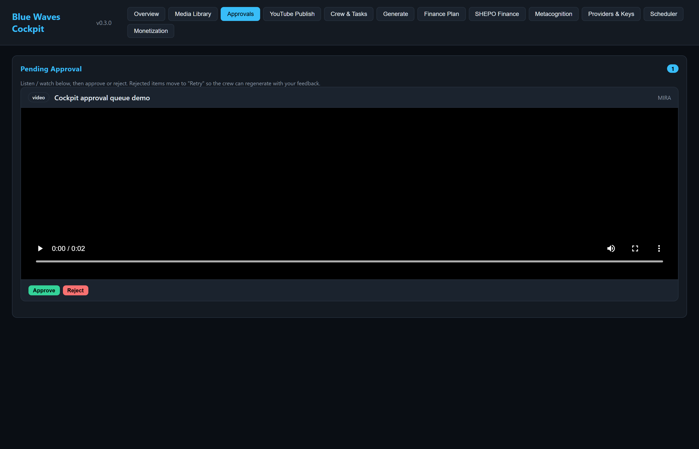

<div align="center">

# Blue Waves

**A multi-format content studio and the first commercial vertical on Helix Codex.**


</div>

## One-line identity

Blue Waves is a multi-format content studio — video, music, and podcasts — and the
first commercial vertical built on the Helix Codex framework. It produces through a
hybrid local/cloud pipeline that stays under the owner's control.

> [!NOTE]
> **Operating principle.** No agent approves its own publish. Every output passes real quality measurements (`ffprobe`, LUFS, FFT, silence detection) before the owner is even asked, and the default is hold. The owner sees exactly what will go out; an unapproved asset stays in the library with a hash-chained audit trail. External actions need the owner's consent — cloud providers fail closed until approved.

## What it does

**Create.** Local generation first (Ken Burns 1080p video, Suno music, ElevenLabs TTS
podcast), with cloud-ready paths (Kling and Seedance video, an ACE-Step local fallback)
and an FFmpeg-first mastering layer. Provider rotation is quota-aware.

**Gate.** Every output passes real quality proxies before approval is considered:

| Medium | Gate |
|---|---|
| Video | 1080p, 30fps, h264, verified by `ffprobe` |
| Music and video audio | 48kHz stereo, -14 LUFS |
| Podcast audio | 48kHz stereo, -16 LUFS |
| All audio | Silence detection and FFT checks |

Approval is blocked if the preview is missing, empty, or below gate.

**Publish or hold.** Approved media moves through the Cockpit. YouTube OAuth is complete
with scopes `youtube.upload` and `yt-analytics.readonly`. Unapproved media stays in the
library with a hash-chained audit trail in `audit_events`. The default is hold. No agent
approves its own publish.

## How it fits Helix Codex

Blue Waves is a **vertical** — the first commercial line built on the Helix Codex
framework. Unlike the component repositories, it **consumes Helix Prime as a live
external client** over the framework's contracts: never embedded, never silent. Helix
Prime remains the same six-engine platform with nine agents, governed memory, and audit
chains, and it remains pre-pilot. The code relationship is a dependency on the
framework's governance contract, with an independent runtime — not shared source.

## Architecture

- `cockpit_ui.py` — 12 navigation panels showing quality metrics, approval status, audit chain.
- Scheduler — `tick()` / `run_automated_cycle()`: queue, generate, quality gate, `awaiting_owner`, retries up to 3, ledger-logged.
- Quality gates — `ffprobe` + FFT + LUFS + silence, hard thresholds.
- Provider rotation — local plus cloud-ready; cloud providers fail closed until approved.
- `audit_events` — hash-chained audit trail; every external action consent-gated.
- SHEPO finance — SHEPO is the finance agent of record: real per-provider costs, CPM projection, break-even, provider ROI.

## Cockpit

The approval queue with a held asset: the owner reviews a real preview before approving or
rejecting, and nothing publishes until the owner approves. The capture is from a local
cockpit instance with a demo asset.



## Production status & test coverage

Stated plainly and dated. This section is last by design. The Snapshot column is the
date that row's evidence was last captured; rows that were not re-measured keep their
original date.

| Evidence | Value | Snapshot |
|---|---|---|
| Tests | 163 collected (147 project + 16 vendored); 147 project tests pass; cockpit E2E flake addressed (client HTTP timeout 30s → 180s) | 2026-10-01 |
| CI (GitHub Actions) | **Red** — `Pylint` and `Python application` both fail on `main` at their lint steps; the pytest step is skipped | 2026-10-01 |
| YouTube OAuth | Complete, client configured, test user active | 2026-09-05 |
| End-to-end video publish | Verified (`NHXdNQzF5m0`) | 2026-09-05 |
| Podcast RSS | Valid, iTunes-compatible RSS 2.0 | 2026-09-05 |
| Quality gates | `ffprobe` + FFT + LUFS + silence, hard thresholds | 2026-09-05 |
| SHEPO finance | Real per-provider costs, CPM projection, break-even, provider ROI | 2026-09-05 |
| Version | v0.3.0 (`pyproject.toml`, `src/blue_waves/__init__.py`) | 2026-10-01 |

> [!WARNING]
> Revenue is **$0**. The studio is pre-revenue; the SHEPO projection is a model, not a receipt. The container image has **never been built** — the repository contains no `Dockerfile` (checked 2026-10-01: `docker build .` fails with `open Dockerfile: no such file or directory`, and the Docker daemon itself is available), so static packaging tests cover the surface. Nine production-only gates remain red by design (no certified data isolation, no external observer audit, no legal privacy review — the nine are enumerated in `docs/SECURITY_REVIEW.md`). No external audit, no signed security review, no assigned on-call owner. GitHub Actions CI is **red** on `main` — both workflows fail at their lint steps and the test step is skipped; the badges above are live and show that state.

## Run it

```bash
pip install -r requirements.txt
python cockpit_ui.py
```

Provider APIs (Suno, ElevenLabs, Kling, Seedance) and YouTube OAuth credentials are
required for generation and publish; local mastering needs ffmpeg. Untracked planning
documents (`docs/FREE_PROVIDER_KEYS.md`, `docs/WINNER_OPTIMIZATION_PLAN.md`) are not
part of the repository and their claims are not counted here.

## Related work

- [Portfolio](https://github.com/HatemIsmailShalaby1979/HatemIsmailShalaby1979) — how this project fits the wider work

## Author

**Hatem Ismail Shalaby** — Operations Architect · AI Systems Engineer · Founder

- GitHub: [HatemIsmailShalaby1979](https://github.com/HatemIsmailShalaby1979)
- LinkedIn: [hatem-shalaby-202902127](https://www.linkedin.com/in/hatem-shalaby-202902127/)
- Email: hatemshalaby2025@gmail.com
- Education: BSc Managerial Sciences (Computer Section), Sadat Academy for Management Sciences; Business Analytics Nanodegree, Udacity

Based in Al Obour City, Al-Qalyubia Governorate, Egypt.

## Licence

MIT
